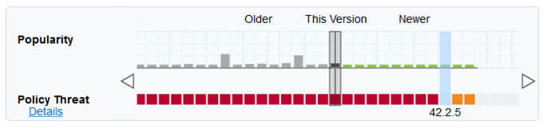

## Hand-on Devops with Nexus-IQ / Jenkins and Docker Tooling

### Event information

The event is posted on [eventbrite](https://www.eventbrite.fr/e/billets-hand-on-devops-avec-loutillage-nexusjenkins-et-docker-51130081450#)

### Place

**[WeWork](https://www.wework.com/buildings/place-ville-marie--montreal--QC)**  
Place Ville Marie  
3 Place Ville Marie Suite 400 Montreal QC H3B 2E3  
Canada  
Wednesday, November 14, 2018 at 13:30

### About me

Kamel NAJJAR, is an Architect and Devops/Cloud Expert for several years, and is involved in various Devops projects in major international companies.

### Summary

A practical workshop focuses on the implementation of DevOps tooling for :
- Understand the Sonatype Nexus ecosystem in its software supply cahin with Nexus LifeCycle
- Understand the DevOps life cycle with associated tooling and specifically designed for this workshop (Jenkins, Nexus-IQ, Gogs, etc.)
- Define and implement a powerful pipeline of continuous deployment with associated tooling
- Using the docker container combined with the Vagrant solution to automate its software deployment chain
- Implement DevSecOps with Nexus LifeCycle and implement a security strategy for its software components

### Prerequisites

- Memory : 6GB
- Disk : 10 GB

### Tools used in the lab
+ [Virtualbox](https://www.virtualbox.org/wiki/Downloads)
+ [Vagrant](https://www.vagrantup.com/downloads.html)
+ [Docker](https://docs.docker.com/install/)
+ [Jenkins](https://jenkins.io/download/)
+ [Sonarqube](https://www.sonarqube.org/downloads/)
+ [Nexus-IQ-Server](https://help.sonatype.com/iqserver/product-information/download-and-compatibility#DownloadandCompatibility-IQServer&CLI)
+ [Gogs](https://gogs.io/docs/installation)

### Application overview


WebGoat is an application offered by the Open Web Application Security Project (OWASP) group. This is an insecure JEE web application that contains several common vulnerabilities in Java applications that use common and popular open source components.

For more information :  
+ [owasp](https://www.owasp.org/index.php/Category:OWASP_WebGoat_Project)  
+ [github](https://github.com/WebGoat/WebGoat/wiki)

### Setting up Vagrant environment

Start by cloning the following github repository, then run and access the vm with the following command :

```markdown
vagrant up && vagrant ssh
```

Compile and run the application
```markdown
cd /home/vagrant/WebGoat
mvn clean install -DskipTests
java -jar webgoat-server/target/webgoat-server-v8.0.0.M20.jar
```

The application is available on http://localhost:9090/WebGoat

### Gogs integration

Perform the first steps of configuring Gogs at http://localhost:3000/ with the following informations :

> **Type de base de données** : PostgreSQL  
> **Hôte** : postgres:5432  
> **Utilisateur** : dbuser  
> **Mot de passe** : dbpass  
> **Nom de base de données** : gogs  
> **Domaine** : localhost  
> **Port SSH** : 10022  
> **Nom d'utilisateur** : administrateur  
> **Mot de passe** : administrateur


#### Push the application

Start by creating **webgoat** repository in Gogs and enable security. Then put the application sources in Gogs

```markdown
cd /home/vagrant/WebGoat
git init
git add .
git commit -m "first commit"
git remote add origin http://localhost:3000/administrateur/webgoat.git
git push -u origin master
```

Check that the repository contains the sources of the application in Gogs.

### Creating a Jenkins Pipeline

Jenkins is available here:

#### Configure Jenkins
> http://localhost:8080/

Start by unlocking jenkins with the following command

```markdown
sudo docker exec jenkins cat /var/jenkins_home/secrets/initialAdminPassword
```

Then, Install the suggested plugins, define an administrator account (admin/admin) and finally put http://localhost:8080/ in instance configuration.

Restart Jenkins
```markdown
sudo docker restart jenkins
```

Install the [Blue Ocean plugin](https://jenkins.io/doc/book/blueocean/getting-started/) for better pipeline visibility.  
Blue Ocean puts Continuous Delivery in reach of any team without sacrificing the power and sophistication of Jenkins.

Follow these steps :
```markdown
Jenkins > Administration > Plugin Management > Available > Blue Ocean
```

#### Create pipeline

```markdown
New item> pipeline> Name: webgoat-pipeline
```
In the
```markdown
Pipeline > Script section
```

Put
```markdown
pipeline {
  agent {
    docker {
      image 'maven:3-alpine'
      args '--network=compose_labnet -u root:root -v /home/vagrant/.m2:/root/.m2'
    }
  }
  stages {
    stage('Maven version') {
      steps {
        sh 'mvn --version'
      }
    }
  }
}
```
Launch the pipeline

***Explanation***
- **maven:3-alpine** is a lightweight image for maven 3  
- Argument **--network=compose_labnet** allows the container to be inside the labnet network which hosts all lab tools (Jenkins, Nexus, etc.)
- The shared folder **/home/vagrant/.m2:/root/.m2** perform a cache operation for maven repository folder between host and container


#### Using Snippet Generator

Clone the application using the snippet generator

> In webgoat-pipeline > Configure > Pipeline > Syntax Pipeline

**Sample Step** : git: Git  
**Repository URL** : http://gogs:3000/administrateur/webgoat.git
**Branch** : master  
**Credentials** : (Ajouter) administrateur/******  

Hit the Generate Pipeline Script Button

```markdown
git credentialsId: 'gogs-credentials', url: 'http://gogs:3000/administrateur/webgoat.git'
```

Here is the result of the pipeline snippet generator

```markdown
pipeline {
  agent {
    docker {
      image 'maven:3-alpine'
      args '--network=compose_labnet -u root:root -v $HOME/.m2:/root/.m2'
    }
  }
  stages {
    stage('Checkout') {
      steps {
        git credentialsId: 'gogs-credentials', url: 'http://gogs:3000/administrateur/webgoat.git'
      }
    }
  }
}
```

Launch the webgoat-pipeline job and see the result

#### Pipeline as Code

Pipeline as Code describes a set of features that allow Jenkins users to define pipelined job processes with code, stored and versioned in a source repository. These features allow Jenkins to discover, manage, and run jobs for multiple source repositories and branches — eliminating the need for manual job creation and management.

Begin by creating a file named Jenkinsfile in the root of webgoat project which contain :

```markdown
pipeline {
  agent {
    docker {
      image 'maven:3-alpine'
      args '--network=compose_labnet -u root:root -v /home/vagrant/.m2:/root/.m2'
    }
  }
  stages {
    stage('Checkout') {
      steps {
        checkout scm
      }
    }
  }
}
```

**Configure webgoat-pipeline to use the Jenkinsfile of our project**

>Jenkins > Configure Job "webgoat-pipeline" > Pipeline > Definition : Pipeline Script from SCM

Save job modification, push Jenkinsfile to Gogs and launch webgoat-pipeline

#### Webhook configuration      

**Jenkins configuration**

Start by installing [gogs plugin](https://github.com/jenkinsci/gogs-webhook-plugin)

**Gogs configuration**

>Webgoat project > Settings > Webgooks > Add webhook -> Gogs  
> **Data URL** : http://jenkins:8080/gogs-webhook/?Job=webgoat-pipeline  
> **Content type** : application/json  

Hit the **Test version** button and check that the Jenkins build is triggered

#### Build webgoat

Integrate the build step of the application into Jenkinsfile

```markdown
stage('build') {
  steps {
    sh 'mvn clean install -DskipTests'
  }
}
```

After pushing to gogs check if the Jenkins Build is treggered automatically

### Code Quality

Sonarqube is available here:

#### Configure Sonarqube
> http://localhost:9000/

Login credentials are:
> admin/admin

Give a name for the token : **my-token** for example

Choose **Java** as project's main language and **Maven** as build technology

Then copy the generated maven command and enrich the Jenkinsfile with the "Quality" stage

```markdown
stage('Code Quality') {
  steps {
    sh 'mvn sonar:sonar \
    -Dsonar.host.url=http://sonarqube:9000 \
    -Dsonar.login=2a0af4e245f2866510b5980d3fd567397489c11b'
  }
}
```

Push the file to Gogs and check the result in Sonarqube

### Policy evaluating

Nexus IQ Server is the policy engine that powers Nexus Firewall, Lifecycle, and Auditor.

- Share component intelligence with your teams so they make better decisions and build better software.
- Implement a fully-customizeable policy engine letting you define which components are acceptable and which are not.
- Integrate with popular development tools like Maven, Eclipse, IntelliJ, GitHub, Jenkins and SonarQube.
- Provide a full suite of supported REST APIs that provide access to core features for custom implementations.
source: [sonatype](https://help.sonatype.com/iqserver)

Nexus-IQ is available here:

#### Configure Nexus IQ
> http://localhost:8070/

Login credentials are:
> admin/admin123

Install your license file. To request a license file send email to info@sonatype.com

**First steps**

>Organization & policies > add Organization > add Application  
>**Organization**: my-org  
>**Application**: webgoat

>Root Organization > Action > Import Policies > Choose [reference-policies-v3.json](https://clm.sonatype.com/rest/referencePolicies/v3) file > Import

#### Configure Jenkins

**Install Nexus Platform plugin**

> Manage Jenkins > Plugin management > Available > Filter: Nexus platform

**Configure the plugin**

> Manage Jenkins > System configuration > Sonatype Nexus > Add Nexus IQ Server  
> **Server URL** : http://nexus-iq:8070/  
> **Credentials** : admin/admin123

Test the connection and save the configuration

**Configure webgoat-pipeline Job**

>Configure webgoat-pipeline > pipeline syntax > choose : nexusPolicyEvaluation: Invoke Nexus Policy Evaluation  
> **Stage** : Build  
> **Application** : webgoat

Hit Generate pipeline script, then copy the result into a new stage inside the Jenkinsfile. Push the file to gogs and check the result with Nexus IQ

```markdown
stage('Analyse des vulnerabilites') {
  steps {
    nexusPolicyEvaluation failBuildOnNetworkError: false, iqApplication: selectedApplication('webgoat'), iqStage: 'build', jobCredentialsId: ''
  }
}
```

**Fix postgresql driver vulnerability**

Begin, by identifying the non-vulnerable version

>**Current version** : 42.2.2  
>**Non vulnerable version** : 42.2.5



Then, put the correct postgresql jar version in pom.xml (webgoat-server & webwolf).  
Push modified files and check the Nexus IQ report.

### Deploy application

Add deploy stage inside the Jenkinsfile with the given snippet

```markdown
stage('deploy') {  	   
  agent any           
    steps {             
      sh 'docker ps -a | grep webgoat && docker stop webgoat && docker rm webgoat || echo "Build and execute container" '               
      sh 'docker build --build-arg webgoat_version=v8.0.0.M20  -t webgoat/webgoat:8.0 ./webgoat-server'    	     
      sh 'docker run --name webgoat -d -p 9090:9090 webgoat/webgoat:8.0'  
    }        
}
```

Push the Jenkinsfile and browse http://localhost:9090/WebGoat
